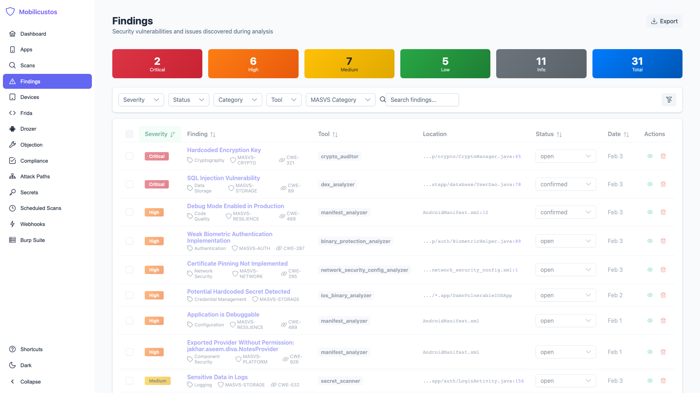
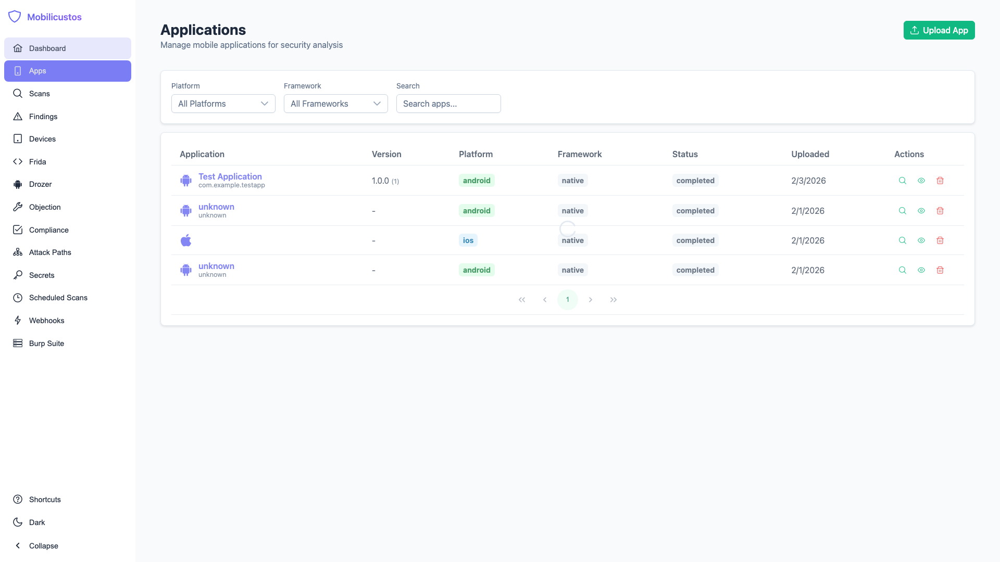
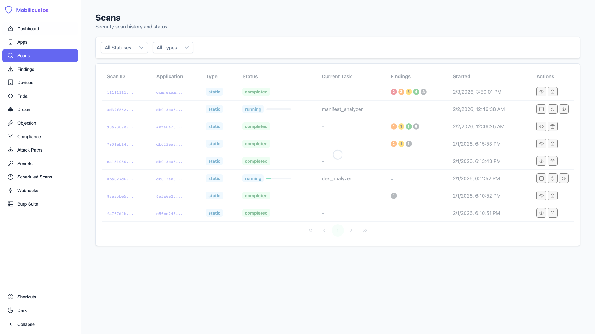
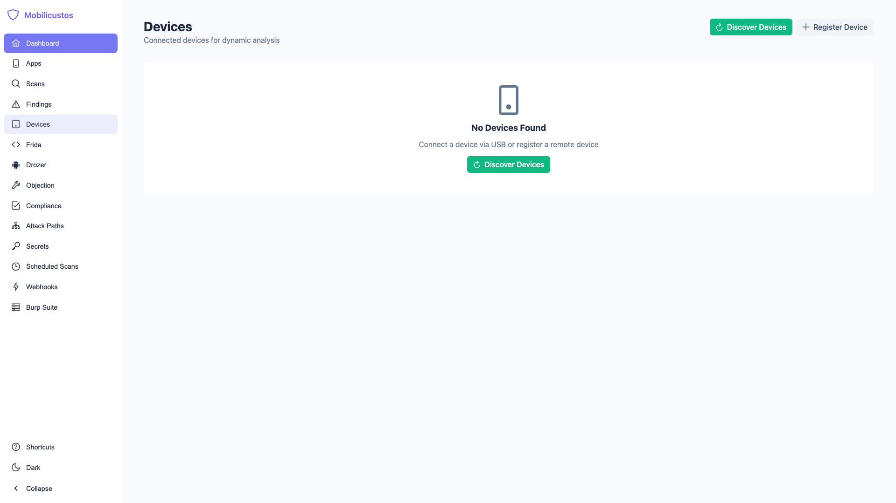

# Mobilicustos

> **Mobile Security Intelligence Platform** - Transform raw mobile app security scans into actionable intelligence with static/dynamic analysis, framework detection, and proof-of-concept verification for Android and iOS applications.

[](https://opensource.org/licenses/MIT)
[](https://python.org)
[](https://docker.com)
[](https://vuejs.org)
[](CONTRIBUTING.md)
[](#platform-support)

*Named from Latin: mobilis (movable) + custos (guardian)*

---

## Why Mobilicustos?

Running mobile security tools is easy. **Understanding what the results mean is hard.**

Mobilicustos doesn't just run tools - it transforms raw scanner output into **actionable security intelligence**:

| Challenge | How Mobilicustos Solves It |
|-----------|--------------------------|
| **10+ tools, 10+ report formats** | Unified findings database with normalized severity, status, and MASVS mapping |
| **Native vs Flutter vs React Native** | Automatic framework detection with specialized analysis per framework |
| **"Is this actually exploitable?"** | Frida scripts and PoC evidence to verify findings on real devices |
| **"Are we compliant?"** | Automatic mapping to OWASP MASVS/MASTG controls |
| **"What changed since last scan?"** | Historical tracking with trend analysis and remediation velocity |
| **"How do I fix this?"** | Remediation knowledge base with code examples and best practices |

---

## Screenshots

### Dashboard

*Security posture overview with severity distribution and recent activity*

### Findings View

*Unified findings with expandable details, severity filtering, and MASVS mapping*

### Applications

*Mobile app inventory with framework detection and analysis status*

### Scans

*Scan management with static, dynamic, and full analysis profiles*

### Devices

*Connected device management for Android emulators, physical devices, and Genymotion*

---

## Key Capabilities

### Unified Security Intelligence

Mobilicustos normalizes output from 10+ mobile security tools into a single, queryable database:

- **One view for all findings** - No more switching between tool-specific outputs
- **Consistent severity mapping** - Critical/High/Medium/Low regardless of source tool
- **MASVS correlation** - Map findings to OWASP Mobile Application Security Verification Standard
- **Deduplication** - Identify when multiple tools flag the same issue

### Framework-Aware Analysis

Automatically detect and apply specialized analysis for each app framework:

| Framework | Detection | Specialized Analysis |
|-----------|-----------|---------------------|
| **Native Android** | Java/Kotlin bytecode | JADX decompilation, manifest analysis |
| **Native iOS** | Swift/Objective-C | Binary analysis, entitlements extraction |
| **Flutter** | libflutter.so/.dylib | Blutter Dart decompilation, snapshot analysis |
| **React Native** | Hermes/JSC bundles | Hermes bytecode decompilation, JavaScript extraction |
| **Xamarin/MAUI** | Mono assemblies | .NET IL analysis |
| **Cordova/Capacitor** | www directory | JavaScript/HTML analysis |

### Proof of Concept Verification

Don't just report findings - **prove they're exploitable**:

- **Frida scripts** - Generated hooking scripts to verify findings on real devices
- **Runtime evidence** - Capture actual exploitation evidence
- **Dynamic testing** - Interact with running apps via connected devices
- **Corellium integration** - Virtual device testing at scale

### OWASP MASVS Mapping

Automatically map findings to **OWASP Mobile Security Standards**:

- MASVS-STORAGE - Data Storage and Privacy
- MASVS-CRYPTO - Cryptography
- MASVS-AUTH - Authentication and Session Management
- MASVS-NETWORK - Network Communication
- MASVS-PLATFORM - Platform Interaction
- MASVS-CODE - Code Quality and Build Settings
- MASVS-RESILIENCE - Resiliency Against Reverse Engineering

### Device Integration

Connect and test on multiple device types:

- **Physical devices** - USB-connected Android/iOS devices
- **Android emulators** - Standard AVD emulators
- **Genymotion** - Cloud and desktop Genymotion instances
- **Corellium** - Virtual iOS/Android devices in the cloud

---

## Quick Start

```bash
# 1. Clone the repository
git clone https://github.com/Su1ph3r/Mobilicustos.git
cd Mobilicustos

# 2. Copy environment file
cp .env.example .env

# 3. Launch the stack
docker compose up -d

# 4. Access the web interface
open http://localhost:3000

# 5. Upload your first APK/IPA via the UI or API
curl -X POST http://localhost:8000/api/apps/upload \
  -F "file=@your-app.apk"

# 6. Start analysis
curl -X POST http://localhost:8000/api/scans \
  -H "Content-Type: application/json" \
  -d '{"app_id": "your-app-id", "scan_type": "static"}'
```

### Windows

```powershell
# Copy environment file
copy .env.example .env

# Set Docker socket path (if needed for Docker Desktop)
# Edit .env and set: DOCKER_SOCKET_PATH=//var/run/docker.sock

# Start services
docker compose up -d

# Access the dashboard
start http://localhost:3000
```

---

## Architecture Overview

```
┌─────────────────────────────────────────────────────────────────────────────┐
│                              MOBILICUSTOS                                    │
│                    Mobile Security Intelligence Platform                     │
├─────────────────────────────────────────────────────────────────────────────┤
│                                                                              │
│  ┌─────────────────┐    ┌─────────────────┐    ┌─────────────────┐         │
│  │  ANALYSIS       │    │   PROCESSING    │    │   PRESENTATION  │         │
│  │  ENGINE         │    │                 │    │                 │         │
│  │ • Static Tools  │───▶│ • Normalization │───▶│ • Vue.js UI     │         │
│  │ • Dynamic Tools │    │ • MASVS Mapping │    │ • REST API      │         │
│  │ • Framework Det │    │ • PoC Gen       │    │ • Exports       │         │
│  │ • Device Mgmt   │    │ • Deduplication │    │ • Reports       │         │
│  └─────────────────┘    └─────────────────┘    └─────────────────┘         │
│           │                      │                      │                   │
│           └──────────────────────┼──────────────────────┘                   │
│                                  ▼                                          │
│                    ┌─────────────────────────┐                              │
│                    │      DATA LAYER         │                              │
│                    │                         │                              │
│                    │ PostgreSQL │ Neo4j      │                              │
│                    │ (Findings) │ (Graph)    │                              │
│                    └─────────────────────────┘                              │
└─────────────────────────────────────────────────────────────────────────────┘
```

### Integrated Analyzers

| Category | Analyzers |
|----------|-----------|
| **Manifest Analysis** | manifest_analyzer, plist_analyzer, entitlements_analyzer |
| **Code Analysis** | dex_analyzer, crypto_auditor, webview_auditor, ipc_scanner, code_quality_analyzer |
| **Binary Protection** | binary_protection_analyzer, native_lib_analyzer |
| **Network Security** | network_security_config_analyzer, api_endpoint_extractor, ssl_pinning_analyzer |
| **Data Storage** | secure_storage_analyzer, secret_scanner, privacy_analyzer, data_leakage_analyzer |
| **Authentication** | authentication_analyzer |
| **Framework-Specific** | flutter_analyzer (Blutter), react_native_analyzer (Hermes-dec), firebase_analyzer |
| **Dependencies & CVE** | dependency_analyzer, CVE detector (OSV/NVD integration) |
| **Attack Paths** | Graph-based attack path analysis with 60+ edge definitions |
| **Dynamic Analysis** | Frida integration, Objection |

---

## Platform Support

### Android
- **APK Analysis** - Manifest, permissions, components, intents
- **Decompilation** - JADX for Java/Kotlin source recovery
- **Dynamic Testing** - Frida hooking on rooted devices/emulators
- **Framework Detection** - Native, Flutter, React Native, Xamarin, Cordova

### iOS
- **IPA Analysis** - Info.plist, entitlements, embedded provisioning
- **Binary Analysis** - Mach-O parsing, string extraction
- **Dynamic Testing** - Frida on jailbroken devices or Corellium
- **Framework Detection** - Native Swift/ObjC, Flutter, React Native

---

## Scan Profiles

| Profile | Duration | Description |
|---------|----------|-------------|
| `static` | 5-15 min | Static analysis only - decompilation, manifest, secrets |
| `dynamic` | 10-30 min | Runtime analysis with Frida on connected device |
| `full` | 20-45 min | Complete static + dynamic analysis |

```bash
# Via API
curl -X POST http://localhost:8000/api/scans \
  -H "Content-Type: application/json" \
  -d '{"app_id": "com.example.app-1.0.0", "scan_type": "full"}'

# Via UI
# Navigate to Apps → Select app → Start Scan → Choose profile
```

---

## Web Frontend

Mobilicustos includes a modern Vue.js 3 web interface:

| View | Description |
|------|-------------|
| **Dashboard** | Security posture overview with severity metrics |
| **Findings** | Searchable findings with expandable details and filtering |
| **Applications** | Mobile app inventory with upload and management |
| **Scans** | Scan history, progress monitoring, and management |
| **Devices** | Connected device management (physical, emulator, Genymotion, Corellium) |
| **App Stores** | Monitor apps from Google Play and App Store |
| **Knowledge Base** | Remediation guidance and security best practices |

Access the frontend at `http://localhost:3000` after starting the stack.

---

## API Highlights

```bash
# Upload an APK/IPA
curl -X POST http://localhost:8000/api/apps/upload \
  -F "file=@app.apk"

# Get unified findings from all tools
curl "http://localhost:8000/api/findings?severity=critical,high"

# Filter by MASVS category
curl "http://localhost:8000/api/findings?masvs_category=MASVS-CRYPTO"

# Export findings to CSV
curl http://localhost:8000/api/findings/export/csv -o findings.csv

# List connected devices
curl http://localhost:8000/api/devices

# Discover Android devices via ADB
curl -X POST http://localhost:8000/api/devices/discover
```

Full API documentation available at `http://localhost:8000/docs` (Swagger UI).

---

## Documentation

| Document | Description |
|----------|-------------|
| [Installation Guide](docs/INSTALL.md) | Detailed setup instructions |
| [Architecture](docs/ARCHITECTURE.md) | System design and component overview |
| [API Reference](docs/API.md) | Complete REST API documentation |
| [Tool Integration](docs/TOOLS.md) | Adding and configuring analysis tools |
| [Contributing](CONTRIBUTING.md) | How to contribute to the project |
| [Changelog](CHANGELOG.md) | Version history and release notes |

---

## System Requirements

| Requirement | Minimum | Recommended |
|-------------|---------|-------------|
| Docker Engine | 20.10+ | Latest |
| Docker Compose | 2.0+ | Latest |
| RAM | 8GB | 16GB |
| Disk Space | 20GB | 50GB |

### Optional
- Android device (rooted) or emulator for dynamic analysis
- iOS device (jailbroken) or Corellium account for iOS dynamic analysis
- Genymotion license for Genymotion device support

---

## Ports

| Port | Service | Description |
|------|---------|-------------|
| 3000 | Frontend | Vue.js web interface |
| 8000 | FastAPI | REST API |
| 5432 | PostgreSQL | Findings database |
| 7474 | Neo4j HTTP | Graph browser |
| 7687 | Neo4j Bolt | Graph queries |
| 6379 | Redis | Cache and job queue |

---

## Contributing

We welcome contributions! See [CONTRIBUTING.md](CONTRIBUTING.md) for guidelines.

---

## Security

Found a vulnerability? Please use GitHub's private vulnerability reporting or email maintainers directly. Do not open public issues for security concerns.

### Security Features

- **Path Traversal Protection** - All file operations validated to prevent directory escape
- **Input Validation** - Strict validation on all API inputs
- **Secure Defaults** - Sandboxed analysis environments
- **Credential Protection** - Secrets detected in apps are redacted in findings

---

## License

MIT License - see [LICENSE](LICENSE) for details.

---

## Acknowledgments

Mobilicustos builds on these excellent open-source security tools:

| Tool | Purpose | License |
|------|---------|---------|
| [JADX](https://github.com/skylot/jadx) | Android DEX decompiler | Apache-2.0 |
| [Frida](https://github.com/frida/frida) | Dynamic instrumentation | wxWindows |
| [Objection](https://github.com/sensepost/objection) | Mobile exploration toolkit | GPL-3.0 |
| [APKTool](https://github.com/iBotPeaches/Apktool) | APK reverse engineering | Apache-2.0 |
| [Blutter](https://github.com/aspect-security/blutter) | Flutter reverse engineering | MIT |
| [Hermes-dec](https://github.com/nickvergessen/hermes-dec) | React Native decompilation | MIT |

---

## Roadmap

- [x] SDK/library vulnerability database (CVE detection via OSV/NVD)
- [x] Attack path analysis with graph-based pathfinding
- [x] Known findings database with YAML definitions
- [ ] Automated app store monitoring
- [ ] CI/CD pipeline integration
- [ ] SARIF export format
- [ ] Slack/Teams notifications
- [ ] Multi-tenancy support

---

<p align="center">
  <strong>Turn mobile security scanner noise into actionable intelligence.</strong>
</p>
